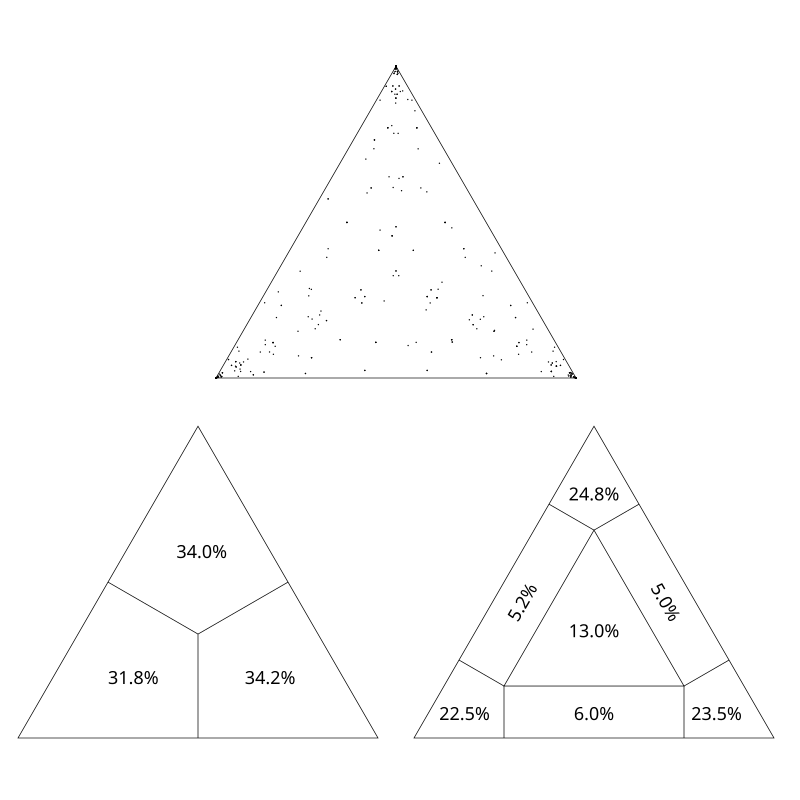
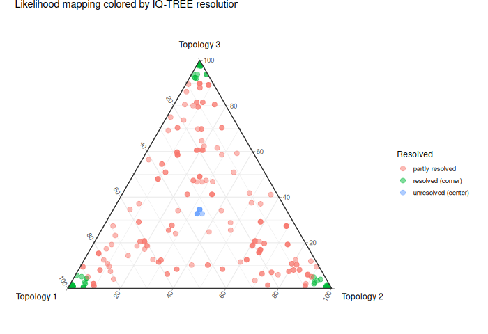

# Likelihood mapping with iqtree3

- Last modified: 2026-06-02 15:06:11
- Sign: Johan Nylander

## Description

Script for running likelihood mapping (Strimmer & von Haeseler, 1997) with
iqtree3 (Minh et al., 2020), and summarize the run as the fraction of highly
supported quartets for the data.

Reads a fasta-formatted input file (multiple sequence alignment) as input,
prints the fraction of "highly supportive" quartets as output (to file or
stdout, or both).

## Installation

The script [`run_iqtree_lmap.sh`](run_iqtree_lmap.sh) is written in bash, and
requires `iqtree3` (www.iqtree.org) to be installed.  The full path to
`iqtree3` can changed directly in the script (line 14) if needed.

In order to utilize all functionality of the provided `Makefile`, GNU make and
GNU parallel needs to be installed.

If `make` is installed, the script can be installed (in `/usr/local/bin`) by using

    $ make install

To install in another location, e.g., `$HOME/bin`, use

    $ make PREFIX=$HOME install

## Usage

    $ run_iqtree_lmap.sh [-n 10000][-a 50][-m TEST][-t AUTO][-c 0.70][-d][-x][-q][-v][-h] infile.fasta

### Options

    -n number -- Specify the number of quartets to be sampled. Default
                 is using a multiplier on the number of sequences in the
                 infile (see option -a).
    -a number -- Specify the multiplier to use for automatically set the
                 number of quartets sampled. The total number of quartets
                 are number of sequences times the multiplier.
                 Default multiplier is 50.
    -m model  -- Specify the substitution model to use. Default is 'TEST'.
    -t number -- Specify number of threads for iqtree3. Default is 'AUTO'.
    -c cutoff -- Specify a cutoff-level (0-1) for files to be reported.
                 If the fraction of supported quartets are below this value,
                 the file name is printed. Default is to print output for all
                 files.
    -d        -- Do not parse the output (the .lmap.quartetlh file).
    -x        -- Remove all iqtree3 output except the .lmap.quartetlh file.
                 Default is to keep all files.
    -q        -- Be quiet (noverbose).
    -v        -- Print version.
    -h        -- Print help message.

### Examples

    $ run_iqtree_lmap.sh -h
    $ run_iqtree_lmap.sh infile.fasta
    $ run_iqtree_lmap.sh -d -x infile.fasta
    $ run_iqtree_lmap.sh -a 25 -c 0.80 -m 'GTR+G4' -t 10 -x -q infile.fasta

### Input

Fasta formatted sequence files (aligned, that is, all sequence entries
should be of the same length).

### Output

The name of the input file and the corresponding fraction of highly supported
quartets are written to a .lmap.out file. The .lmap.quartetlh from iqtree3
(example [here](data/example.lmap.quartetlh.tsv)) will also be kept (other
files from iqtree3 can be removed using `-x`). If the `-c` option is used, the
file name of the files not matching the cutoff standard will be printed to
stdout. This list can then be captured in downstream steps.

### Plotting

iqtree3 will produce graphical summaries of the output (.eps, .svg format).  It
is fairly straightforward to produce your own plots using, for example,
packages in R, with the .lmap.quartetlh file as input.  Here is one example:
[plot_quartetlh.R](scripts/plot_quartetlh.R).

## License and Copyright

Copyright (C) 2021-2026 Johan Nylander <johan.nylander@nrm.se>
Distributed under terms of the [MIT license](LICENSE).

## Likelihood mapping run manually

### 1. Run iqtree3

    $ iqtree3 -s data/infile.fasta -lmap ALL -wql -n 0 -m TEST

The `data/infile.fasta.lmap.quartetlh` file -- an example (first two lines):

    SeqIDs  lh1     lh2     lh3     weight1 weight2 weight3 area    corner
    (8,3,17,16)     -7456.47        -7532   -7522.94        1       0       0       1       1

- lh1 is the log-likelihood of the quartet tree {8,3} | {17,16}
- lh2 is the log-likelihood of the quartet tree {8,17} | {3,16}
- lh3 is the log-likelihood of the quartet tree {8,16} | {3,17}
- weight1 = exp(lh1) / (exp(lh1)+exp(lh2)+exp(lh3))
- weight2 = exp(lh2) / (exp(lh1)+exp(lh2)+exp(lh3))
- weight3 = exp(lh3) / (exp(lh1)+exp(lh2)+exp(lh3))
- (That means, they are the likelihood weights of the 3 quartets).

### 2. Parse the `.lmap.quartetlh` file to give proportion of well-supported quartets

That is, count the number of times a quartet ends up in any of the "corner"
areas 1, 2, or 3, over the total number of sampled quartets.

    $ awk 'BEGIN{i=0}!/SeqIDs/{i=i+1; if($8==1||$8==2||$8==3) a=a+1}END{print a/i}' data/infile.fasta.lmap.quartetlh

## Try also

If you have several fasta files and a multi-core computer, you may also try to
run the likelihood mapping in parallel (by utilizing the provided
[`Makefile`](Makefile) and `data` folder):

1. Make sure you have `iqtree3`, `make`, and `parallel` (GNU parallel)
   installed
2. Put your fasta-formatted alignments (files ending in `.fas`) in the `data`
   folder
4. Run

       $ make run > lmap.out &

## Links and further reading

- [Minh et al. 2020](https://academic.oup.com/mbe/article/37/5/1530/5721363)
- [Strimmer and von Haeseler 1997](doc/Strimmer_von_Haeseler_1997.pdf)
- [igtree3, www.iqtree.org](http://www.iqtree.org)
- [Likelihood-mapping in iqtree3, www.iqtree.org/doc/Command-Reference#likelihood-mapping-analysis](http://www.iqtree.org/doc/Command-Reference#likelihood-mapping-analysis)
- [Post on google groups, groups.google.com/g/iqtree/c/OcfgC0RF110](https://groups.google.com/g/iqtree/c/OcfgC0RF110)
- [GNU parallel, www.gnu.org/software/parallel](https://www.gnu.org/software/parallel/)
- [GNU make, www.gnu.org/software/make](https://www.gnu.org/software/make/)

